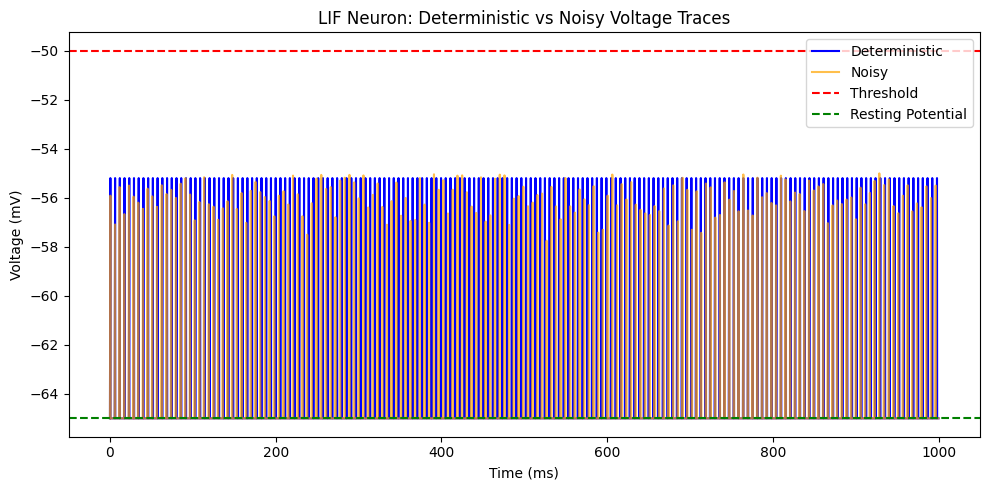

# Leaky Integrate-and-Fire Neuron Model

---

## Task

This project implements a **Leaky Integrate-and-Fire (LIF)** neuron model — one of the simplest and most biologically interpretable models of neuronal spiking.  
It mathematically derives the governing equations, simulates them under deterministic and noisy current inputs, and visualizes voltage traces, spike rasters, and inter-spike interval (ISI) distributions.

---

## Mathematical Explanation

The membrane of a neuron behaves like a leaky capacitor with resistance **Rₘ** and capacitance **Cₘ**.  
Using **Kirchhoff’s Current Law (KCL)**, the sum of currents through the resistor and capacitor equals the input current:

\[ I(t) = I_C + I_R = C_m \frac{dV}{dt} + \frac{(V - V_{rest})}{R_m} \]

Rearranging the equation gives:

\[ C_m \frac{dV}{dt} = -\frac{(V - V_{rest})}{R_m} + I(t) \]

Defining the **membrane time constant**:

\[ \tau_m = R_m C_m \]

We can rewrite the equation as:

\[ \frac{dV}{dt} = \frac{-(V - V_{rest}) + R_m I(t)}{\tau_m} \]

A spike is generated when:

\[ V(t) \geq V_{th} \]

After which the potential resets to:

\[ V(t) = V_{reset} \]

and the neuron enters a short **refractory period** during which it cannot spike again.

---

## Biological Explanation

Biologically, this model represents how a neuron integrates incoming electrical signals (input currents) over time.  
The **membrane potential (V)** reflects the voltage difference between the inside and outside of the neuron.

- **Sodium (Na⁺)** ions drive depolarization — when the neuron’s potential becomes more positive. Sodium channels open rapidly, allowing Na⁺ to flow into the cell.
- **Potassium (K⁺)** ions drive repolarization — when the neuron’s potential returns to resting levels. K⁺ channels open after Na⁺ influx, allowing K⁺ to exit the cell, restoring the negative charge.
- The alternating movement of Na⁺ and K⁺ ions produces a complete **action potential**, followed by the refractory phase.

---

## What We Are Doing

1. Simulating the LIF model using **Euler’s method** for numerical integration.  
2. Injecting two types of input currents:
   - **Deterministic current:** constant input for periodic spiking.
   - **Noisy current:** Gaussian noise added to mimic biological irregularity.
3. Exporting results as CSVs for time-voltage and spike events.
4. Visualizing results with plots of:
   - Membrane potential (V vs Time)
   - Spike rasters (timing comparison)
   - Inter-spike interval distributions

---

## Approach

- Derived the differential equation from KCL.  
- Implemented it in Python using NumPy and Matplotlib.  
- Simulated both constant and noisy input currents.  
- Exported and visualized simulation data for further analysis.

### Trade-Offs

| Aspect | Simplicity | Biological Accuracy |
|--------|-------------|----------------------|
| **LIF Model** | Easy to compute, fast | Ignores detailed ion channel dynamics |
| **Hodgkin-Huxley Model** | Biophysically detailed | Computationally expensive |

The LIF model acts as a **baseline** — capturing fundamental neuron firing behavior efficiently.

---

## Model Information

### Parameters Used

| Parameter | Symbol | Value | Unit |
|------------|---------|--------|------|
| Resting Potential | \( V_{rest} \) | -65 | mV |
| Threshold Potential | \( V_{th} \) | -50 | mV |
| Reset Potential | \( V_{reset} \) | -65 | mV |
| Membrane Resistance | \( R_m \) | 100e6 | Ω |
| Membrane Capacitance | \( C_m \) | 0.1e-9 | F |
| Time Constant | \( \tau_m = R_m C_m \) | 0.01 | s |
| Input Current | \( I_{mean} \) | 2e-9 | A |
| Noise Std Dev | \( \sigma_I \) | 0.5e-9 | A |
| Refractory Period | \( t_{ref} \) | 5e-3 | s |

### Core Equation (Euler Integration)

\[
V(t + \Delta t) = V(t) + \frac{\Delta t}{\tau_m} [-(V(t) - V_{rest}) + R_m I(t)]
\]

---

## Flow of Ions and Spike Generation

### Role of Na⁺ and K⁺

- **Depolarization:** Na⁺ channels open → Na⁺ enters → potential rises.
- **Repolarization:** K⁺ channels open → K⁺ exits → potential falls.
- **Hyperpolarization:** K⁺ outflow overshoots → membrane briefly becomes more negative than rest.

### Ion Exchange and Spike Trigger

The spike arises because Na⁺ influx exceeds K⁺ efflux, driving a rapid depolarization.  
Afterward, K⁺ channels restore balance, completing the spike cycle.

---

## Results

### CSV Files Generated

| File | Description |
|------|--------------|
| `lif_deterministic.csv` | Time vs. voltage (deterministic input) |
| `lif_noisy.csv` | Time vs. voltage (noisy input) |
| `spikes_deterministic.csv` | Spike times for deterministic neuron |
| `spikes_noisy.csv` | Spike times for noisy neuron |

### Visual Outputs

Below is the visualization generated by the simulation:

---

## Observations

- Deterministic neuron fires **periodically** (~170 Hz).  
- Noisy neuron fires **irregularly**, with small ISI variation.  
- Increasing noise broadens the ISI distribution and increases variability.

---

## Conclusion

The project demonstrates how neuronal spiking emerges from passive membrane dynamics and how stochastic fluctuations influence precision.  
It bridges physical RC-circuit behavior with biological neuron activity using the LIF framework.

---

**Developed by:** Krushna Thakkar  
**Environment:** Python 3.11 (NumPy, Matplotlib, Pandas)  
**Data Folder:** `/data` — contains all generated CSV and PNG outputs.
